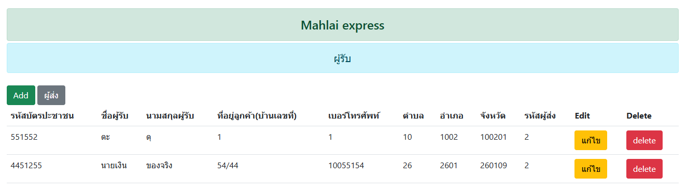

# MahExpress

ระบบจัดการข้อมูล MahExpress พัฒนาโดยใช้ PHP และฐานข้อมูล MySQL โดยทำงานผ่าน XAMPP และ phpMyAdmin

## 🛠 เทคโนโลยีที่ใช้

- PHP (สำหรับฝั่งเซิร์ฟเวอร์)
- MySQL (จัดการฐานข้อมูล)
- XAMPP (Apache + MySQL + phpMyAdmin)
- HTML/CSS (แสดงผลหน้าเว็บพื้นฐาน)

## 📦 ฟีเจอร์ (เบื้องต้น)

- เชื่อมต่อฐานข้อมูล MySQL ผ่าน phpMyAdmin
- บันทึก / แก้ไข / ลบ ข้อมูลจากฟอร์ม
- โหลดข้อมูลจากฐานข้อมูลมาแสดง

## ⚙ การติดตั้งระบบ

1. ดาวน์โหลดและติดตั้ง [XAMPP](https://www.apachefriends.org/index.html)
2. เปิด XAMPP และเริ่มบริการ Apache และ MySQL
3. โคลนหรือดาวน์โหลดโปรเจกต์นี้ลงในโฟลเดอร์ `htdocs`:

    ```bash
    git clone https://github.com/MZmixZerZ/MahExpress.git
    ```

4. เปิดเบราว์เซอร์แล้วไปที่ `http://localhost/phpmyadmin`
5. สร้างฐานข้อมูลใหม่ชื่อ `mahexpress` แล้ว import ไฟล์ SQL:

    - ไปที่เมนู **Import**
    - เลือกไฟล์ `database/mahexpress.sql` จากโปรเจกต์

6. เปิดโปรเจกต์ในเบราว์เซอร์:

    ```
    http://localhost/MahExpress/
    ```

## 🖼 รูปภาพประกอบ

### ตัวอย่างหน้าจอแสดงรายการผู้รับ




```markdown

```

**ตัวอย่าง**:

```markdown

```

## 📁 โครงสร้างโปรเจกต์

```
MahExpress/
├── index.php
├── config/
│   └── db.php
├── database/
│   └── mahexpress.sql
├── docs/
│   └── images/
└── ...
```

## 📄 License

MIT License
